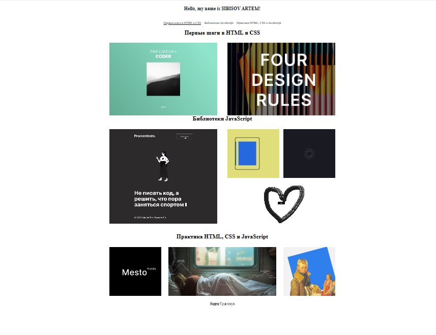

# **First-project**
*Первые шаги в HTML и CSS*

---
## ***Описание и функциональность***

Моя первая закоммиченная html страница выполненная во время прохождения одной из вводных частей обучения по html и css в Яндекс.Практикуме.

Страница отображает в качестве ознакомления некоторые библиотеки и проекты с которыми предстоит познакомиться в процессе обучения.

---
## ***Ссылка на выполненную работу на GitHub Pages:***
https://sibisov-artem.github.io/first-project/
<!-- ### *Скриншот выполненной работы:*
 -->
---

## ***Используемые технологии:***
### *HTML*
* Семантические теги
* БЭМ-методология
### *СSS*
* Flexbox
* Псевдоклассы CSS
* Анимация элементов
---
## ***Инструкция по развёртыванию:***
Поскольку в проекте не используются сборщики или планировщики, то проект нужно просто клонировать или скачать архивом и распаковать. После чего открыть index.html в браузере.

Клонировать репозиторий на свой компьютер через командную строку:
```
git clone https://github.com/Sibisov-Artem/first-project.git
```

<!-- 
- Инструкция по развёртыванию и системные требования (версия языка, нужные для работы расширения). Это важно, чтобы запустить код и проверить, что он действительно работает.
- Планы по доработке проекта, если они есть. Не общее «провести рефакторинг», а «исправить X с помощью Y, чтобы получить Z». Чем конкретнее — тем лучше.
- Можно добавить обширную документацию проекта, настройку CI для его запуска, список людей, которые над ним трудились. Но это касается крупных проектов и не нужно для первых учебных примеров кода. 
-->

